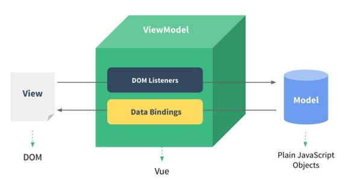

## 一、简介
### 1.1 Vue.js
Vue是一个渐进式的框架，渐进式意味着你可以将Vue作为你应用的一部分嵌入其中。
### 1.2 Vue 安装
方式一：直接CDN引入
<!-- 开发环境版本，包含了有帮助的命令行警告 --> 

<!-- 生产环境版本，优化了尺寸和速度 -->

方式二：下载和引入
开发环境 https://vuejs.org/js/vue.js 
生产环境 https://vuejs.org/js/vue.min.js

方式三：NPM安装
### 1.3 Vue中的MVVM

